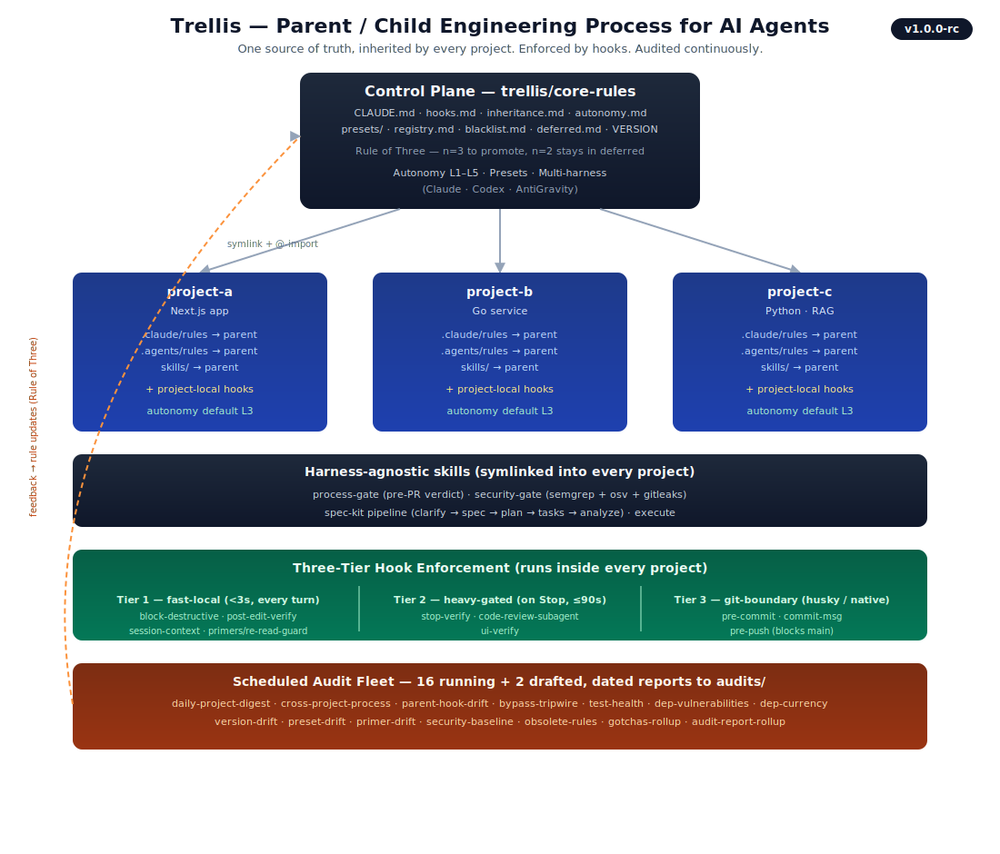

<div align="center">

# Trellis

### Engineering process for AI coding agents.

**One source of truth. Inherited by every project. Enforced by hooks. Audited weekly.**

*A trellis gives a climbing plant the structure to grow on. This one does the same for code an AI agent writes — without it the work sprawls and breaks; with it, it grows tall and clean.*

[](#release)
[](LICENSE)
[](https://docs.claude.com/en/docs/claude-code)
[](https://github.com/openai/codex)
[](#quick-start)
[](#requirements)

[Quick start](#quick-start) · [What you get](#what-you-get) · [Architecture](#architecture) · [Repo layout](#repo-layout) · [FAQ](#faq)

</div>

---

## Why this exists

The first time you let a coding agent write production code it feels like a superpower. The tenth time, you notice the corners it's been cutting: pushed straight to `main`, marked a task "done" when the tests never ran, summarised what it intended to do instead of what it actually did, force-pushed over an hour of your work to "clean things up."

None of those are bugs in the model. They are gaps in the *process* around the model — the same gaps human teams spent decades closing with branch protection, code review, commit conventions, CI gates, and a thousand small rituals. An agent has none of that scaffolding by default.

**Trellis is that scaffolding, opinionated, in one repo, forkable in ten minutes.**

---

## What you get

| | |
|---|---|
| 📜 **Parent rules in one place** | `core-rules/CLAUDE.md` is the single source of truth. Every project inherits via symlink — Claude Code through `.claude/rules/`, Codex through `AGENTS.md` + `.agents/`. |
| 🪝 **Hooks across three tiers** | Fast-local (<3s every turn) · Heavy-gated (on `Stop`, ≤90s) · Git-boundary (husky / native git hooks). Blocks `rm -rf ~`, force-pushes, direct pushes to `main`, secrets reads, and "done" without receipts. |
| 🧠 **9 canonical skills** | The auto-invoked spec-kit pipeline (`clarify → spec → plan → tasks → analyze`), the surgical-default `execute` skill, the harness-agnostic `process-gate` and `security-gate`, and mandatory pre-creative `brainstorming` — one implementation each, symlinked into every project. |
| ✅ **A harness-agnostic process-gate** | Runs the same way in Claude Code, Codex, `claude -p`, and CI. Emits a fixed verdict block: `MERGEABLE / NEEDS CHANGES / BLOCKED`. The companion `security-gate` runs semgrep + osv-scanner + gitleaks under a provider-neutral triage layer. |
| 🔍 **A fleet of 16 scheduled audits** | Daily digest plus weekly/monthly/quarterly sweeps for hook drift, `--no-verify` bypasses, dep CVEs, test rot, version/preset/primer drift, and security baselines. Every report is dated markdown — grep, diff, quote in commits. (Two more are drafted and parked.) |
| 🎚 **Autonomy slider (L1–L5)** | Dial how much the agent decides on its own — Pedagogical → Cautious → Standard (default) → Initiative → Autonomous — per session (`/autonomy N`) or per project. Bright-line safety guardrails fire at *every* level. |
| 🧩 **Presets** | Drop-in policy bundles (`compliance-strict`, `experimental-loose`) that clamp the autonomy ceiling and tune the gates for a project's risk profile. The `preset-drift` audit keeps them honest. |
| 📐 **Rule of Three for evolution** | New rules wait in `core-rules/deferred.md` until a 3rd independent project adopts them. n=2 is the danger zone. |
| 🤖 **Multi-harness parity, opt-in or opt-out** | Same policy intent across Claude Code and Codex. The `harnesses` array in `trellis.config.json` is the single switch — drop the one you don't use. Codex inherits via the shared `AGENTS.md` / `.agents/` surface (rules + skills are byte-identical with Claude Code); its workflow slash-commands land at `.agents/workflows/`. |

---

## Skills

Trellis ships **9 canonical skills** in `core-rules/skills/` — one implementation each, symlinked into every project so they behave identically across Claude Code, Codex, and CI.

| Skill | When it fires | What it does |
|---|---|---|
| **spec-kit pipeline** | Auto-invoked from frontmatter on feature work | A five-stage flow — `clarify → spec → plan → tasks → analyze` — that turns a fuzzy ask into a reviewed spec, an executable plan, and a task list before code is written. No command to remember; the agent discovers and runs it. |
| **execute** | The surgical default | Single-file fixes and small changes that don't warrant a full spec. The fast path for bug fixes. |
| **process-gate** | Pre-PR, harness-agnostic | Emits a fixed verdict block: `MERGEABLE / NEEDS CHANGES / BLOCKED`. The same gate in Claude Code, Codex, `claude -p`, and CI. |
| **security-gate** | On security-relevant changes | semgrep + osv-scanner + gitleaks under a provider-neutral LLM triage layer. |
| **brainstorming** | Before any creative work | Mandatory exploration of intent, requirements, and design before implementation begins. |

---

## Architecture

<div align="center">
  
</div>

The control plane owns the rules, the skills, and the autonomy/preset defaults. Projects inherit through symlinks. Skills shape the work (spec-kit pipeline, `execute`, `process-gate`, `security-gate`). Hooks enforce in the moment. Audits enforce over time. The Rule-of-Three loop keeps the parent layer honest.

---

## Quick start

> **Two ways to set up. Pick one.**

### (A) Agent-driven — ~10 minutes, recommended

1. Clone this repo.
2. Open it in Claude Code or Codex (or paste [`AGENT_SETUP.md`](AGENT_SETUP.md) into any agent session with filesystem tools).
3. The agent interviews you for paths/harness/name, fills placeholders in-place, optionally enables Codex parity, installs the inheritance symlinks, and seeds the canonical hooks.

That's it. No manual sed.

### (B) Manual — ~30 minutes

Follow [`SETUP.md`](SETUP.md) step by step.

### After setup — onboard each project

Paste [`AGENT_ONBOARD_PROJECT.md`](AGENT_ONBOARD_PROJECT.md) into an agent open inside your customised `trellis/`. It interviews you, runs `scripts/onboard-project.sh`, wires the project's `CLAUDE.md`, updates `registry.md`, and commits.

Works for new projects, fresh clones of registered projects, and drift repair.

---

## The three tiers, in 30 seconds

```
Tier 1 — fast-local         < 3s, every agent turn
─────────────────────────────────────────────────────
block-destructive   denies rm -rf ~, git push --force, DROP TABLE, .env reads
post-edit-verify    lints just the touched file (eslint/ruff/clippy/govet)
session-context     injects last session's state on SessionStart
inject-primer-index injects the project's primer index on SessionStart
reread-guard        nudges re-reading a file before editing a stale copy
save-context-log    writes context-log.md on PreCompact / Stop
post-compact-context  re-injects context-log.md after compaction
truncation-check    flags >50K-char tool results

Tier 2 — heavy-gated         ≤ 90s, on Stop
─────────────────────────────────────────────────────
stop-verify             open todos? typecheck? lint? fast tests? → block on any fail
code-review-subagent    dispatches a read-only reviewer on edit-heavy turns (≥3 files)
ui-verify               boots dev server + screenshots affected route on UI changes
propose-rules           (experimental, opt-in) surfaces candidate parent rules

Tier 3 — git-boundary        husky or native git hooks
─────────────────────────────────────────────────────
pre-commit          lint-staged on staged files
commit-msg          Conventional Commits, project-configured scope allowlist
pre-push            blocks direct push to main; runs typecheck/lint/tests
```

Every tier has the same escape hatch — `TRELLIS_ALLOW_MAIN_PUSH=1`, `--no-verify`, override env vars — and every escape hatch is **noisy**. The `bypass-tripwire` audit surfaces every use within 8 days, and the audit reports persist in git.

---

## The audit fleet

Sixteen scheduled tasks, registered as cron jobs, sweep every project in `registry.md`:

| Audit | Cadence | What it catches |
|---|---|---|
| `daily-project-digest` | Daily 08:00 | Per-project morning status — branch, last commit, 7-day activity, open audit hits, suggested next move. Always emits. |
| `cross-project-process-audit` | Mon 10:00 | Hook presence, staleness, required files, inheritance wiring |
| `registry-blacklist-health` | Mon 10:30 | Registry ↔ filesystem ↔ blacklist consistency |
| `test-health` | Mon 11:00 | Fast suite green/red across the registry, last-green bisect on red |
| `dep-currency` | Mon 11:30 | Outdated-dep scan: patch / minor / major drift |
| `version-drift` | Mon 11:45 | `trellis_version` pin drift across the registry; major drift = critical |
| `preset-drift` | Mon 12:00 | Declared-vs-installed preset symlinks across the registry |
| `primer-drift` | Mon 12:15 | Primer freshness — stale / missing / unreachable primer pins |
| `bypass-tripwire` | Weekdays 08:00 | Silent unless someone used `--no-verify`, force-push, or direct-to-main |
| `dep-vulnerabilities` | Weekdays 08:30 | CVE / GHSA via native pkg-mgr audit + osv-scanner |
| `parent-hook-drift` | Sun 21:00 | SHA256 canonical-vs-deployed comparison for every hook |
| `gotchas-rollup` | 1st of month | Rule-of-Three engine — promotes n≥3 patterns to parent rules |
| `audit-report-rollup` | 1st of month | Month-over-month trend report across every other audit |
| `dep-major-upgrade-watch` | 1st of month | Framework-tier (Next, React, TS, Node) drift vs. your watchlist |
| `security-baseline` | Quarterly | Fleet-wide security baseline (semgrep + osv-scanner + gitleaks) |
| `obsolete-rules` | Quarterly | Prunes model- / harness-compensating rules that have aged out (removal-only) |

Two more are written and parked, waiting for evidence they're needed: `lint-debt-trend` and `large-file-watch`.

Reports land in `audits/YYYY-MM-DD-<task>.md`. Examples (redacted) live in [`examples/audits/`](examples/audits/).

---

## Tooling

A handful of `scripts/` round out the control plane:

- **`scripts/doctor.sh`** — health check for a Trellis clone or an onboarded project: inheritance wiring, hook presence, drift, required files.
- **`scripts/worktree.sh`** + **`scripts/seed-inheritance-symlinks.sh`** — git worktrees inherit the parent's rules and hooks automatically, so a worktree is governed the same as its primary checkout.
- **`scripts/disk-janitor.sh`** + **`scripts/install-disk-janitor-launchd.sh`** — report-first fleet disk reclaim (build caches, package stores), optionally on a `launchd` schedule on macOS.
- **Primers** — a per-project index of entry points and key files, injected at session start by the `inject-primer-index` hook and kept fresh by the `primer-drift` audit. See [`docs/primers/`](docs/primers/).

---

## Repo layout

```
.
├── README.md                  ← you are here
├── SETUP.md                   ← human-facing setup walkthrough
├── AGENT_SETUP.md             ← paste-into-agent prompt that does setup for you
├── AGENT_ONBOARD_PROJECT.md   ← onboard a project after Trellis is bootstrapped
├── LICENSE                    ← MIT
│
├── core-rules/                ← THE PARENT LAYER — what every project inherits
│   ├── CLAUDE.md              ← terse parent rules
│   ├── AGENTS.md              ← symlink → CLAUDE.md for Codex parity
│   ├── hooks.md               ← spec for the canonical hooks (3 tiers)
│   ├── hooks/                 ← canonical Claude Code hook implementations
│   ├── codex/                 ← canonical Codex hooks.json + hook scripts
│   ├── husky/                 ← canonical pre-commit / commit-msg / pre-push
│   ├── skills/                ← 9 canonical skills (spec-kit, execute, process-gate, security-gate, brainstorming…)
│   ├── autonomy.md            ← the L1–L5 autonomy slider
│   ├── presets/               ← policy bundles (compliance-strict, experimental-loose)
│   ├── templates/             ← per-project file templates (gotchas, context-log)
│   ├── inheritance.md         ← how Claude and Codex inheritance work
│   └── deferred.md            ← rules waiting for their 3rd project (Rule of Three)
│
├── registry.md                ← list of projects under Trellis management
├── blacklist.md               ← projects to skip
│
├── engineering-process.md     ← THE MANUAL — narrative source of truth
│
├── scheduled-tasks/           ← 16 audits + 2 drafts; each is prompt + targets
├── scripts/                   ← onboard-project, doctor, worktree, disk-janitor, sync-hooks…
├── audits/                    ← generated audit reports land here
├── examples/audits/           ← redacted sample reports
└── docs/                      ← provenance + LIFT/LEAVE/DEFER recon
```

---

## What you customise

Five placeholders. Setup replaces them in-place.

| Placeholder | What it becomes | Example |
|---|---|---|
| `__TRELLIS_PATH__` | Absolute path where you cloned this repo | `/Users/jane/projects/trellis` |
| `__PROJECTS_ROOT__` | Absolute path to the parent dir holding your projects | `/Users/jane/projects` |
| `__MAINTAINER_NAME__` | Your name | `Jane Doe` |
| `__GITHUB_USER__` | Your GitHub handle | `janedoe` |
| `__USER_HOME__` | Your home dir (rare — legacy refs only) | `/Users/jane` |

`AGENT_SETUP.md` walks any LLM through asking you for these values and substituting them.

---

## Requirements

- **macOS or Linux** with `bash`, `git`, and `jq` on `PATH`. Hooks degrade gracefully if `jq` is missing.
- **Node.js** for projects using husky. (For Unity / Rust / Go / Python-only projects, see [`core-rules/inheritance.md`](core-rules/inheritance.md) → "Native git hooks".)
- **Claude Code and/or Codex.** The `harnesses` array in `trellis.config.json` accepts any combination. Codex inherits via the shared `AGENTS.md` / `.agents/` surface; its slash commands land in `.agents/workflows/`.
- **Codex hooks opt-in** requires Codex CLI with hooks support and `[features] hooks = true` in `$CODEX_HOME/config.toml` (the older `codex_hooks` key is deprecated as of Codex CLI 0.129+).

---

## FAQ

<details>
<summary><b>Why Claude Code <i>and</i> Codex?</b></summary>

Different harnesses have different strengths and I use whichever fits the project. Forcing a single harness everywhere would mean giving up the other. Trellis keeps the policy intent identical across both — same rules, same skills, each with its own hook envelope — so the choice is per-project, not per-process.

</details>

<details>
<summary><b>Why the Rule of Three?</b></summary>

n=1 is anecdote. n=2 is coincidence dressed as a pattern. n=3 is the cheapest sample size that lets you commit to an abstraction without locking in the wrong shape and the wrong defaults. Unwinding a bad parent rule across five projects is painful. Waiting for the third witness is free.

</details>

<details>
<summary><b>What if I disagree with a parent rule?</b></summary>

Fork it, edit `core-rules/CLAUDE.md`, done. The parent layer is yours after you clone. Trellis is opinionated, not prescriptive — the value is the *shape* (parent + child + hooks + audits + Rule of Three), not any specific rule.

</details>

<details>
<summary><b>Can I use this without Codex / without Claude Code?</b></summary>

Yes. The `harnesses` array in `trellis.config.json` accepts any subset of `["claude", "codex"]`. Onboarding only seeds artifact trees for enabled harnesses — `.codex/hooks*` and the shared `AGENTS.md` + `.agents/{rules,skills,primers,workflows}/` surface (including the `.agents/workflows/` slash commands) whenever Codex is enabled.

</details>

<details>
<summary><b>What about projects without <code>package.json</code> (Unity, Rust, Go, Python)?</b></summary>

Native git hooks under `.githooks/` with `git config core.hooksPath = .githooks`. The PR-flow guard (`pre-push` blocking direct push to `main`) is the same; husky just isn't the vehicle. See [`core-rules/inheritance.md`](core-rules/inheritance.md) → "Native git hooks".

</details>

<details>
<summary><b>How much does the agent decide on its own?</b></summary>

You choose, with the autonomy slider — five levels from **L1 Pedagogical** (ask before every non-trivial action) through **L3 Standard** (the default: plan-approval on multi-step work, flags ambiguity) to **L5 Autonomous** (decides silently, logs decisions). Set it per session with `/autonomy N` or per project in `.trellis.config.json`; presets clamp the ceiling. The bright-line safety guardrails — no destructive commands, no `--no-verify`, no direct push to `main` — fire at *every* level, including L5. See [`core-rules/autonomy.md`](core-rules/autonomy.md).

</details>

<details>
<summary><b>How do I tune the rules?</b></summary>

Per-project overrides live in `.claude/hooks/config.sh` (and `.codex/hooks/config.sh` if applicable). The parent hook scripts are read-only; projects point them at their tools via env vars. See [`hooks.md`](core-rules/hooks.md) → "Project overrides". For broader policy shifts, drop in a **preset** (`core-rules/presets/`) instead of editing rules one by one.

</details>

---

## Release

**Trellis 1.0.0-rc.** Stable enough to fork and run in earnest; the `-rc` tag means the parent layer and skill set are settling toward a 1.0 that won't move under you. See [`core-rules/VERSION`](core-rules/VERSION).

---

## Write-up

Longer-form blog posts walking through the design decisions, the principles, and the lessons:

→ **[Trellis: An Engineering Process for AI Coding Agents](https://akaushik.org/writing/trellis)** — the original design post.

→ **[Trellis 1.0-rc](https://akaushik.org/writing/trellis-1-0-rc)** — what landed for the release candidate: skills, the autonomy slider, presets, and the wider audit fleet.

---

## License

MIT — see [`LICENSE`](LICENSE) and [`docs/PROVENANCE.md`](docs/PROVENANCE.md) for upstream attribution.

---

<div align="center">

Built and maintained by [**Abhishek Kaushik**](https://akaushik.org).

If you fork it, tell me what you change — the Rule of Three only works with three witnesses.

</div>
