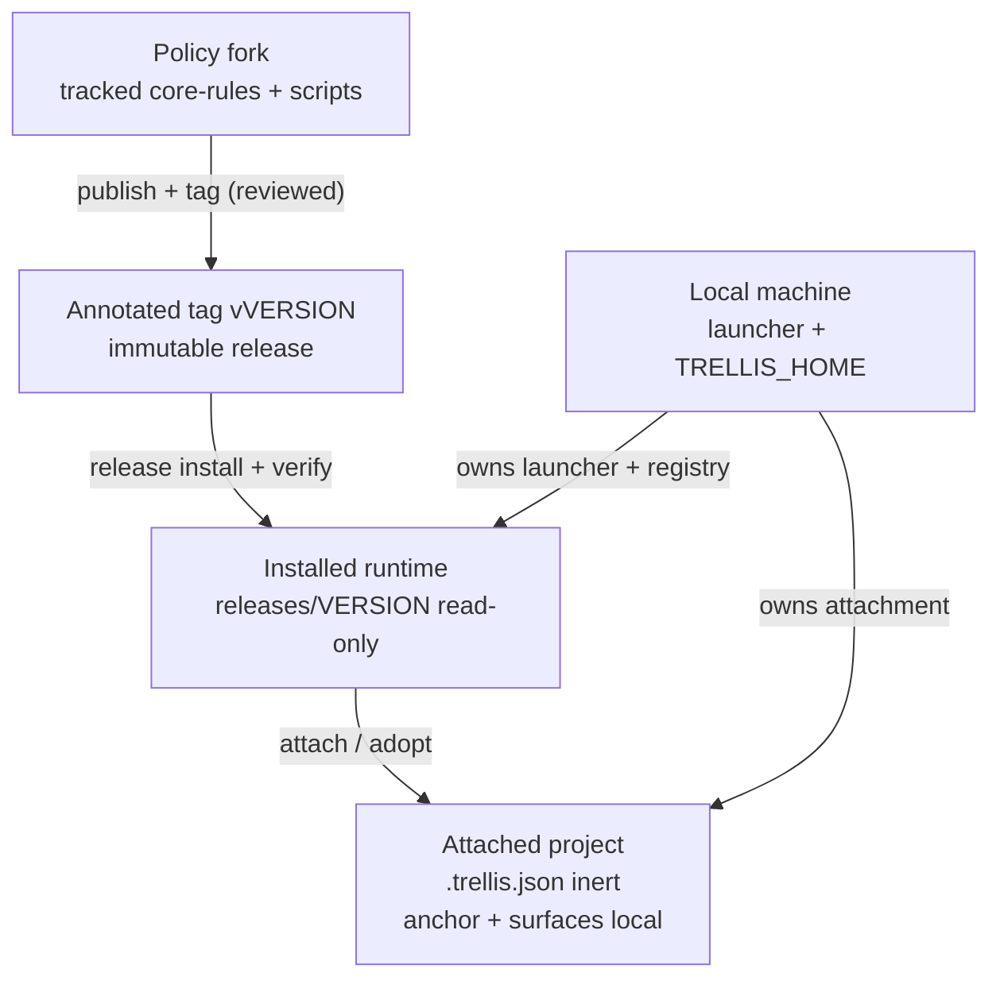
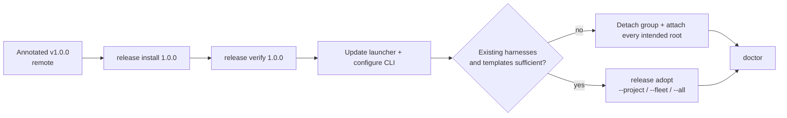

# Trellis

> **Portable starting point.** This public projection is what you fork and install from. For the 1.0.0 launcher, shared-worktree, and full Pi-selector migration, read **[docs/MIGRATING-1.0.0.md](docs/MIGRATING-1.0.0.md)** first.

Trellis is a portable engineering-process control plane for AI-assisted projects: one set of parent rules, harness surfaces, skills, and hooks that every opted-in project inherits locally.

Source version: [`core-rules/VERSION`](core-rules/VERSION) (`1.0.0`). Tag `v1.0.0` is immutable once published — consumers verify it; nobody retags or moves it.

## What Trellis does

Fork the policy, install one verified immutable release, and attach your projects explicitly. Each project tracks a tiny inert manifest; everything behavior-producing (runtime anchor, harness surfaces, registry rows, recovery state) stays on your machine, outside Git.

## Four boundaries

| Layer | What it is | Where it lives |
|---|---|---|
| **Policy source** | Tracked rules, skills, hooks, templates (`core-rules/`, `scripts/`, `trellis.config.json`) | Your fork / clone |
| **Immutable installed runtime** | Verified payload installed from annotated tag `vVERSION` (`core-rules/VERSION` must match) | `$TRELLIS_HOME/releases/VERSION/` (read-only) |
| **Local machine / registry** | Launcher, machine config, fleet inventory, attachment ownership | `$HOME/.local/bin/trellis`, `$TRELLIS_HOME/config.json`, `registry.json`, `state/` — never committed |
| **Attached projects** | Ordinary Git worktrees with one optional inert manifest | `<project>/.trellis.json` tracked; anchors and surfaces stay local |

A contributor who clones only a project (including `.trellis.json`) gets an inert ordinary clone: no Trellis install required, no harness behavior activated. Branch moves and dirty source trees never change an attached project's runtime.


```mermaid
flowchart TB
    SRC["Policy fork<br/>tracked core-rules + scripts"]
    REL["Annotated tag vVERSION<br/>immutable release"]
    HOME["Local machine<br/>launcher + TRELLIS_HOME"]
    PAY["Installed runtime<br/>releases/VERSION read-only"]
    PROJ["Attached project<br/>.trellis.json inert<br/>anchor + surfaces local"]

    SRC -->|"publish + tag (reviewed)"| REL
    REL -->|"release install + verify"| PAY
    PAY -->|"attach / adopt"| PROJ
    HOME -->|"owns launcher + registry"| PAY
    HOME -->|"owns attachment"| PROJ
```

## Harnesses: Claude, Codex, Pi

Attachment renders native surfaces from the verified payload. Selector names in `core-rules/inheritance-manifest.json` are `claude`, `codex`, and `pi` (`shared_agents` comes along automatically with `codex`/`pi`).

- **Claude Code:** `.claude/rules/`, `.claude/skills/`, `.claude/hooks/`, commands.
- **Codex:** `AGENTS.md`, `.agents/rules/`, `.agents/skills/`, `.codex/hooks.json` + hooks.
- **Pi:** native `.pi` settings and extension surfaces plus shared `.agents` rules, skills and workflows per [`AGENT_PI_SETUP.md`](AGENT_PI_SETUP.md) — bring your own providers and write your own roster from the schema there.

Capability outcome classes: **enforced** (deny), **advisory** (warn), **unsupported** (no hook on that harness), **unknown** (native behavior without sufficient observation). No 100% parity is claimed. `scripts/harness-conformance.py` supplies adapter fixtures. Native receipts must identify the harness and observed behavior separately.

## Get started

| You want to | Read |
|---|---|
| Set up a fresh machine + launcher + fleets | [`AGENT_SETUP.md`](AGENT_SETUP.md) |
| Attach a new or existing project worktree | [`AGENT_ONBOARD_PROJECT.md`](AGENT_ONBOARD_PROJECT.md) |
| Move an existing machine to a new release | [`AGENT_UPGRADE.md`](AGENT_UPGRADE.md) + [`docs/UPGRADING.md`](docs/UPGRADING.md) |
| Migrate to 1.0.0 (launcher, worktree, Pi selectors) | [`docs/MIGRATING-1.0.0.md`](docs/MIGRATING-1.0.0.md) |
| Add the opt-in Pi harness | [`AGENT_PI_SETUP.md`](AGENT_PI_SETUP.md) |

Full support on a project requires naming every harness explicitly and repeating the flag:

```bash
"$TRELLIS" onboard --home "$TRELLIS_HOME" --fleet "$FLEET" --release 1.0.0 --project-id "$PROJECT_ID" \
  --harness claude --harness codex --harness pi \
  "$PROJECT_ROOT"
```

The default does **not** include Pi. Attachment defaults to Claude Code and Codex. Changing `trellis.config.json` does not select attachment harnesses.

## Quick safe upgrade (1.0.0)

Runs only through the installed stable launcher (`$HOME/.local/bin/trellis`). Never run release/upgrade scripts from a source checkout — they refuse by design.

```bash
TRELLIS="$HOME/.local/bin/trellis"
test -x "$TRELLIS"
RELEASE_REMOTE=https://github.com/Zireael26/trellis.git
: "${TRELLIS_HOME:?set the existing local Trellis home}"
: "${FLEET:?set the intended fleet}"
: "${PROJECT_ID:?set the intended project ID}"
"$TRELLIS" release install 1.0.0 --remote "$RELEASE_REMOTE"
"$TRELLIS" release verify 1.0.0

# Continue with docs/MIGRATING-1.0.0.md to configure the CLI and
# choose project adoption or a full harness render.
```

Use `--fleet NAME` or `--all` only as separately reviewed wider scopes. Install never adopts; adoption never infers `latest`, a branch, or a new path. Details and rollback: [`docs/UPGRADING.md`](docs/UPGRADING.md).


```mermaid
flowchart LR
    TAG["Annotated v1.0.0<br/>remote"]
    INST["release install 1.0.0"]
    VER["release verify 1.0.0"]
    ADOPT["release adopt<br/>--project / --fleet / --all"]
    DOC["doctor"]

    TAG --> INST --> VER --> CLI["Update launcher + configure CLI"] --> CHOICE{"Existing harnesses<br/>and templates sufficient?"}
    CHOICE -->|yes| ADOPT
    CHOICE -->|no| RENDER["Detach group + attach every intended root"]
    RENDER --> DOC
    ADOPT --> DOC
```

`trellis upgrade VERSION --project/--fleet/--all` is the same install → verify → adopt sequence in one command (forward-only; it cannot roll back onto an already-installed release — use explicit `release verify` + `release adopt` for that).

## Pi note

[`AGENT_PI_SETUP.md`](AGENT_PI_SETUP.md) is a historical recipe pinned at `pi 0.84.4` (`npm install --global @earendil-works/pi-coding-agent@0.84.4`). It is not an instruction to downgrade an existing Pi. Patch bundles and measurements on other versions are documented separately in that guide. You supply your own providers; this projection carries no provider roster.

## Autonomy and presets

Trellis defaults to L3 (Standard) on the L1–L5 responsibility slider. Set a portable per-project default via `autonomy` in `<project>/.trellis.json`, or `/autonomy N` for a session override. Presets (`compliance-strict`, `experimental-loose`) clamp the slider without forking parent rules. See `core-rules/autonomy.md` and `core-rules/presets/`.

## What an upgrade never does

- Never scans for `latest`, rewrites a tracked pin, or adopts unselected rows.
- Never tags, pushes, or mirrors; publishing is a separate reviewed operation.
- Never overwrites an installed release; an existing version install is refused.
- Never makes a project run from a source checkout or a guessed path.

## Requirements (source-verified only)

macOS or Linux, `bash` 3.2+, `git` 2.30+, `jq`, `perl`. Optional: `ajv` via `npx`, Node.js + husky for Node projects, Codex CLI, Pi agent. No other platform or toolchain claim is made here.

## Key docs

- [`AGENT_SETUP.md`](AGENT_SETUP.md) — machine setup (bootstrap `configure.sh` only).
- [`AGENT_ONBOARD_PROJECT.md`](AGENT_ONBOARD_PROJECT.md) — project attach walkthrough.
- [`AGENT_UPGRADE.md`](AGENT_UPGRADE.md) + [`docs/UPGRADING.md`](docs/UPGRADING.md) — immutable-release upgrade reference.
- [`docs/MIGRATING-1.0.0.md`](docs/MIGRATING-1.0.0.md) — 1.0.0 migration.
- [`core-rules/inheritance.md`](core-rules/inheritance.md) + [`core-rules/inheritance-manifest.json`](core-rules/inheritance-manifest.json) — multi-harness contract.
- [`core-rules/hooks.md`](core-rules/hooks.md), [`engineering-process.md`](engineering-process.md).
- [`CHANGELOG.md`](CHANGELOG.md) — release notes.

## License

MIT — see [`LICENSE`](LICENSE).
