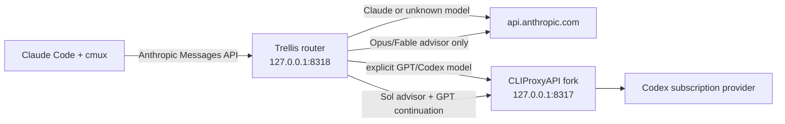
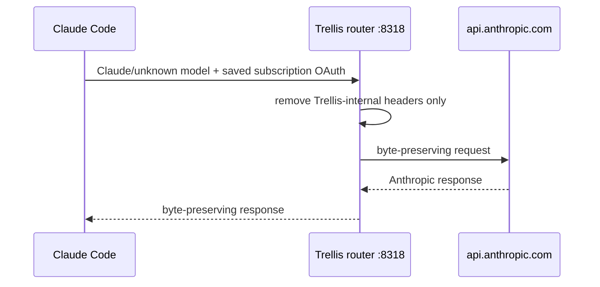
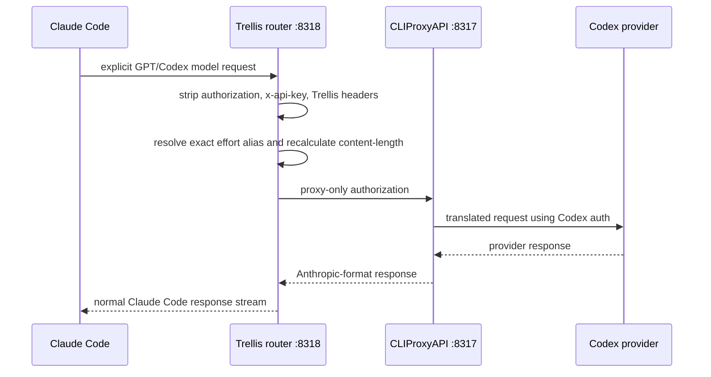

# GPTX: GPT models inside the Trellis Claude Code harness

> **Requires two subscriptions.** GPTX routes selected requests to GPT models through a local gateway, so it needs BOTH a Claude subscription and a Codex subscription. It is off by default (`gptx.enabled` in `trellis.config.json`, spec 028), and nothing else in Trellis depends on it — a single-subscription install is fully functional without ever enabling GPTX.

GPTX keeps Claude Code as the terminal, tool loop, Agent surface, and team UI while
routing explicitly selected GPT model requests through a local translation lane. cmux
keeps managing workspaces and panes. Trellis owns mode resolution, provider policy,
advisor selection, effort profiles, and failure behavior.

GPTX does not patch Claude Code and does not require the OpenAI Codex plugin for Claude
Code. It is still unofficial. Anthropic's official gateway documentation says:

> “Anthropic doesn't endorse, maintain, or audit third-party gateway products, and
> doesn't support routing Claude Code to non-Claude models through any gateway.”

Source: [Other LLM gateways](https://code.claude.com/docs/en/llm-gateway), accessed
2026-07-29. “Native” in this documentation means **native-feeling harness participation**,
not Anthropic support for GPT models.

## Turning GPTX on

Two independent things have to be true, and they are deliberately separate:

1. **Capability** — run `scripts/gptx/install.sh`. This installs the router and is
   what makes the GPT lane physically reachable.
2. **Doctrine** — set the switch in `trellis.config.json` (or a project-local
   `.trellis.config.json`, which wins):

   ```json
   "gptx": { "enabled": true }
   ```

Resolution is most-specific-wins: project-local → central → built-in *off*. Absent,
`false`, and malformed all resolve to **off**; malformed fails closed on purpose,
since off can only withdraw an instruction to use a lane and never invent one.

With the switch off, `core-rules/references/model-routing.md` is the whole of routing
doctrine: no inherited file names a `gpt-*` profile as a routing target and no
cross-family mix quota binds. Turning it on additionally puts
`core-rules/references/model-routing-cross-family.md` in force. Spec: `specs/028`.

The split exists because an install can legitimately be switched off — capability
means the installer ran; the switch means the doctrine applies.

## Architecture



| Component | Responsibility | Trust boundary |
|---|---|---|
| Claude Code | conversation, tools, Agent calls, teammate UI, permissions | Unmodified vendor client |
| cmux | workspace, pane, and session management | Unmodified local manager |
| `cmux-trellis-teams` | resolve mode/model/advisor/delegate policy and inject session-scoped settings | Trellis checkout |
| Trellis router (`8318`) | classify lane, strip/inject headers, normalize GPT effort aliases, run advisor transactions | Loopback process holding in-memory request credentials |
| CLIProxyAPI fork (`8317`) | Anthropic-format translation for explicit GPT requests and advisor server-tool bridge | Loopback translator with proxy-only credentials |
| Agent provider guard | classify resolved Agent model/provider before spawn and enforce `--delegates` | Claude Code `PreToolUse` caller boundary |
| Codex catalog | source of subscription model context windows | Local authenticated Codex installation |

Maintained translator provenance:

- [__GITHUB_USER__/CLIProxyAPI](https://github.com/__GITHUB_USER__/CLIProxyAPI), MIT;
- upstream [router-for-me/CLIProxyAPI](https://github.com/router-for-me/CLIProxyAPI), MIT;
- reviewed pin
  [`108b2a535b0241491436149b65cfb78734c61280`](https://github.com/__GITHUB_USER__/CLIProxyAPI/commit/108b2a535b0241491436149b65cfb78734c61280).

## Closed routing predicate

The router sends only explicit GPT/Codex families to the translator. Claude and unknown
models default to Anthropic:

```text
explicit gpt-*, codex-*, oN*, *-sol|terra|luna -> CLIProxyAPI
claude-* and every unknown model              -> api.anthropic.com
```

Claude IDs win over suffix matching, including adversarial names such as a
`claude-...-sol` ID. The offline routing table in `gptx-doctor` and hermetic tests cover
that precedence.

Unknown IDs defaulting to Anthropic is a credential-safety choice, not a promise that
Anthropic accepts the model. An unknown model may fail upstream; the router does not try a
second provider.

## Modes and independent selectors

| Mode | Main session | Default advisor | Intended use |
|---|---|---|---|
| `gptx` | Claude Opus | `auto` (Opus, then visible Sol fallback) | Claude main loop with selectively addressed GPT Agents |
| `codex` | GPT-5.6 Sol xhigh | Sol | GPT main loop and independently selectable Agent providers |
| `hybrid` | GPT-5.6 Sol xhigh | Opus, then visible Sol fallback | GPT main loop with cross-model advice |
| `claude` | direct Claude Opus | Opus | No routed GPT main lane |

Four selectors own different decisions:

- `--mode gptx|codex|hybrid|claude` chooses default topology and main model;
- `--model <alias-or-model-id>` overrides only the main model;
- `--advisor auto|opus|fable|sol|none` chooses only advisor policy;
- `--delegates auto|gpt|claude|none` controls which providers Agent calls may request.

Omitting `--delegates` is `auto`. `gpt`, `claude`, and `none` are locks, not preferences.
They reject mismatched or unknown Agent providers before spawn. Explicit selections never
silently become another provider.

`cmux-trellis-teams` ultimately runs `cmux claude-teams` and forwards unrelated arguments
in order. Panes, teams, hooks, resumability, permissions, and terminal behavior remain
Claude Code/cmux behavior.

## Request flows

### Claude request



Setting only `ANTHROPIC_BASE_URL` does not replace a saved Claude subscription login.
Anthropic documents that the saved login remains active and that a gateway forwarding
subscription traffic must preserve the OAuth capability in `anthropic-beta`. GPTX's
Anthropic lane is designed around that documented behavior.

### GPT request



On this lane, the original Claude `authorization` and `x-api-key` never reach CLIProxyAPI.
The local proxy key is injected only after stripping Claude credentials.

### GPT advisor transaction

When a GPT main model calls Claude Code's `advisor` tool:

1. CLIProxyAPI translates the GPT tool call.
2. The maintained fork accepts only the high-entropy Trellis loopback callback.
3. It turns the ordinary translated tool block into `server_tool_use`.
4. The router runs the selected Opus, Fable, or Sol advisor.
5. The router performs exactly one continuation on the original GPT main model with the
   advisor removed from the available tools.
6. The fork appends `advisor_tool_result` and continuation blocks to the same response.
7. Claude Code continues its normal agent loop.

One 270-second absolute deadline covers queue wait, advice, and continuation. Default
concurrency is two. Concurrent duplicate delivery shares one pending promise; later
redelivery before parent settlement replays the exact cached response. Callback socket
disconnect is not cancellation authority. Callback state is memory-only and the status
endpoint exposes sanitized counters, never prompts, credentials, or advice bodies.

A GPT child that declares `advisor` but loses the session selection header receives the
safe Sol default. Present selections still win. Explicit `none` fails closed without
executing any advisor.

`auto` may visibly fall back from Opus to Sol only on the documented limit path. Explicit
`opus`, `fable`, and `sol` stay pinned. Provider/stage circuit breakers fast-fail repeated
transport, 408, or 5xx failure; they do not invent a provider substitution.

## Native-feeling participation in Claude Code surfaces

GPTX reuses Claude Code's existing tool and task machinery rather than adding plugin
commands for each operation. These claims remain subject to the unsupported gateway
boundary above.

| Surface | How GPT participates | Lifecycle |
|---|---|---|
| Advisor | GPT main emits the normal advisor tool call; the fork/router return Claude Code's server-tool transcript shape | One bounded transaction, one GPT continuation |
| Subagent | Agent call selects a registered `gpt-*` definition; Claude Code runs an isolated Agent context and receives the direct result | Unnamed result returns to caller |
| Agent team | Root spawns a named teammate using a `gpt-*` definition; same mailbox/task UI remains in use | Named teammate remains live until released |
| Dynamic Workflow | Trellis Workflow recipe calls `agent(..., {agentType: "gpt-*"})`; stage identities and receipts remain in the Workflow engine | Engine-run agents auto-terminate |

Anthropic officially describes subagents as isolated contexts that return results to the
caller and agent teams as independent Claude Code sessions with a shared task list and
direct messaging. Agent teams are experimental and disabled by default. GPTX does not
change those semantics; it changes the model lane selected for a registered Agent type.

Flat-roster rule:

- root may create a named teammate mailbox;
- named teammates and nested callers omit `name` on nested Agent calls;
- unnamed subagent results return directly;
- named identities never enter `TaskOutput` or task-list polling;
- root uses mailbox messages/`SendMessage` and releases accepted or abandoned named work.

The public release certification matrix requires separate live receipts for named
teammates, unnamed subagents, and a bounded Dynamic Workflow. See
[`specs/027-gptx-public-release/`](../specs/027-gptx-public-release/).

## Agent provider enforcement

The launcher installs a session-scoped Agent `PreToolUse` guard and exports a versioned
child-model alias map. Classification order:

1. explicit Agent `model`;
2. launcher slot aliases such as `opus`, `sonnet`, `haiku`, and `fable`;
3. provider-stable full model IDs and canonical Trellis aliases;
4. absent model or `inherit` through registered `subagent_type`;
5. everything else as `unknown`.

This matters in `codex` and `hybrid`: the `opus` slot resolves to GPT for the mapped main
model, while literal `claude-opus-5` remains Claude. Missing, stale, malformed, or
mismatched policy data rejects the Agent call before spawn and requires a fresh
`cmux-trellis-teams` launch.

The guard reports requested model, resolved model, source, and effective provider but does
not rewrite `model`, `subagent_type`, or `name`. Those are pre-spawn receipts; live
transcripts provide final provider attestation.

Policy does not guarantee capacity. A direct Claude topology may permit GPT under `auto`
while lacking a route able to execute it. That is a visible lane failure, not permission
to substitute Claude.

## Effort profiles and context

Agent roster:

- `gpt-mid`: Sol medium for bounded strong-oracle work;
- `gpt-high`: Sol high for moderately complex cross-file work;
- `gpt-sol`: Sol xhigh for difficult, weak-oracle, security-sensitive, or consequential
  work;
- `gpt-terra`: Terra xhigh throughput lane for large sustained output against a
  pre-existing oracle. A stronger advisor is recommended, not required;
- `gpt-sol-advisor`: read-only Sol xhigh advisor for a Claude main-session override.

Exact aliases `gpt-5.6-sol-medium`, `gpt-5.6-sol-high`, and
`gpt-5.6-sol-xhigh` normalize only on the GPT lane. The router:

- records requested alias;
- executes base model `gpt-5.6-sol`;
- overwrites `output_config.effort` with medium/high/xhigh;
- recalculates `content-length`;
- records sanitized requested/execution/effort fields.

Explicit Agent model overrides remain authoritative.

Trellis derives GPT context from the installed Codex model catalog, not from an API model
page. The reviewed catalog exposes a raw 272,000-token window, so the launcher sets
`CLAUDE_CODE_MAX_CONTEXT_TOKENS=272000` for the resolved GPT model. It leaves
`CLAUDE_CODE_AUTO_COMPACT_WINDOW` unset because that setting is process-wide and would
prematurely cap native Claude sessions.

Run `trellis model-context gpt-5.6-sol` to inspect the current machine's catalog receipt.

## Failure behavior

| Condition | Behavior |
|---|---|
| Unknown main model | Anthropic lane; upstream may reject; no second provider |
| Explicit advisor unavailable | Fail selected advisor; no fallback |
| `auto` Opus limit | Visible persisted Sol fallback with retry time |
| Locked Agent provider mismatch/unknown | Reject before spawn |
| Stale alias policy | Reject before spawn; relaunch required |
| Terra advice absent/fails | Proceed; report missing advice as residual risk |
| GPT quota/auth unavailable | Visible GPT-lane failure; certification returns `QUOTA` (exit 2) |
| GPT provider outage | Certification returns `UPSTR` (exit 2), never `FAIL`; no baseline recorded |
| New `anthropic-beta` flag after certification | Router reports `unverified` with the flag named; lane keeps serving |
| Advisor duplicate callback | Share pending transaction or replay settled response |
| Advisor transaction deadline | Settle bounded failure; no indefinite retry |
| Transient proxy 408/5xx | Request fails; credential-wide cooldown disabled |
| Real auth/quota/rate limit | Normal cooling remains enabled |
| Required Workflow stage returns null/wrong identity | Fail stage closed; no filtered false-success |

Detailed controls, residual risks, and incident guidance:
[GPTX security](gptx-security.md).

## GPTX and the OpenAI Codex plugin

OpenAI's [Codex plugin for Claude Code](https://github.com/openai/codex-plugin-cc)
provides `/codex:*` commands for reviews, rescue/delegation, transfer, and asynchronous job
management. It uses a local Codex CLI/app server and includes a plugin subagent.

| Dimension | OpenAI Codex plugin | GPTX |
|---|---|---|
| Primary interface | `/codex:review`, `/codex:rescue`, `/codex:status`, and related commands | `--mode`, `--advisor`, `--delegates`, normal Agent calls, teams, and Trellis Workflows |
| Runtime | Plugin + Codex CLI/app server | Trellis router + maintained CLIProxyAPI fork |
| Main-model routing | Claude remains main; Codex handles plugin jobs | Claude or GPT can own main loop by mode |
| Agent participation | Plugin-provided subagent/job boundary | Registered `gpt-*` Agent types through existing harness surface |
| Background jobs | Plugin `status`/`result`/`cancel` lifecycle | Claude Code Agent/team lifecycle or Workflow engine receipts |
| Provider policy | Command chooses Codex job | Orthogonal main/advisor/delegate selectors with fail-closed locks |
| Anthropic support | Plugin is third-party to Anthropic | Non-Claude gateway routing explicitly unsupported by Anthropic |
| Required by GPTX | No | Not applicable |

The plugin may coexist for operators who explicitly want its command/job workflow. It is
optional legacy compatibility in Trellis and never an automatic fallback from GPTX. See
[legacy Codex plugin compatibility](legacy/codex-plugin.md).

## Prior art and measured difference

Community projects commonly connect Claude and Codex through one of three boundaries:

- a Stop hook that blocks Claude exit and launches parallel Codex review agents;
- slash-command workflows that persist plan/review artifacts;
- an MCP server that lets Claude call Codex for plan, implementation, or review rounds.

Those are useful, inspectable designs. GPTX changes the boundary rather than claiming a
universal quality win: GPT requests can occupy the same main-model, Agent, teammate, and
Trellis Workflow positions already used by Claude Code. That removes a separate
command/job handoff for those positions. It also adds local services, credential routing,
unsupported gateway risk, and a stricter certification burden. Exact community sources
and pinned commits are recorded in [GPTX sources](references/gptx-sources.md).

## Installation, security, and certification

- setup and rollback: [Agent onboarding: GPTX](../AGENT_ONBOARD_GPTX.md);
- threat model: [GPTX security](gptx-security.md);
- generated truth tables:
  [session policy](gptx-session-policy-matrix.md) and
  [model overrides](gptx-model-override-matrix.md);
- source provenance: [GPTX sources](references/gptx-sources.md);
- release certification: [Spec 027](../specs/027-gptx-public-release/).

GPTX publication is gated on every live-required Spec 027 row. Hermetic tests prove
routing, transforms, and failure behavior; they do not replace real provider, Agent,
team, Workflow, or reversible-install receipts.
